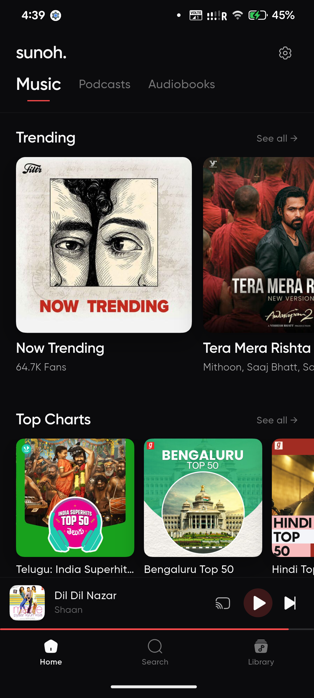
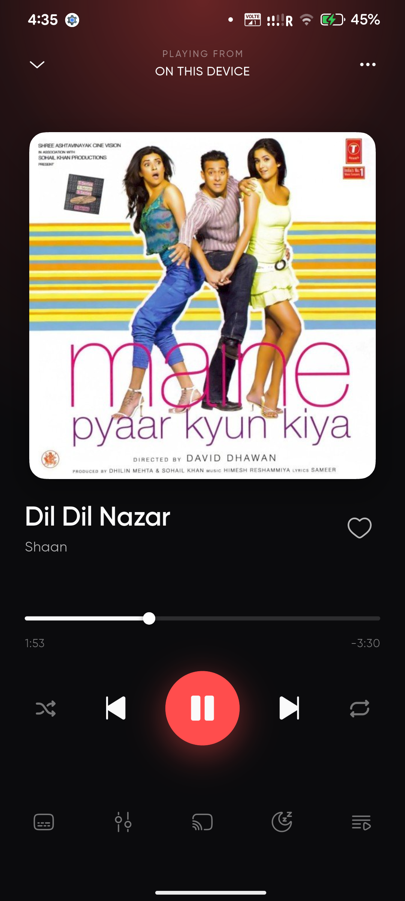
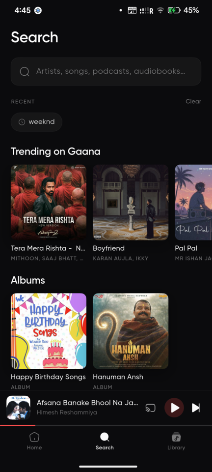
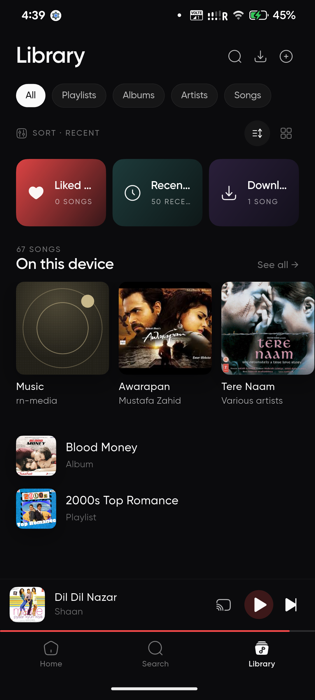
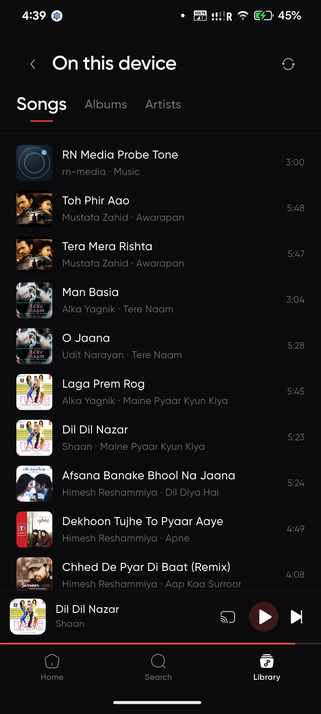
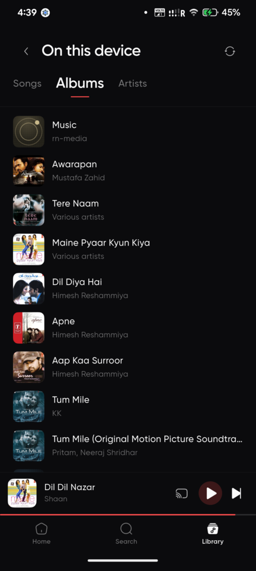

<div align="center">

# sunoh.

**A music app for Android that plays streaming and on-device music through one
interface.**

YouTube Music, Gaana and Saavn behind a single search — plus the music already
on your phone, podcasts, and audiobooks.

No ads. No account. No tracking.

[](https://github.com/afkcodes/sunoh/releases/latest)
[](https://github.com/afkcodes/sunoh/releases)
[](LICENSE)


</div>

---

## Download

**[Latest release](https://github.com/afkcodes/sunoh/releases/latest)** — take
`app-arm64-v8a-release.apk` unless your phone is 32-bit. Android 7.0+.

### Obtainium (recommended)

[Obtainium](https://github.com/ImranR98/Obtainium) tracks GitHub releases and
updates the app for you. Add this URL:

```
https://github.com/afkcodes/sunoh
```

Obtainium picks the right ABI automatically. sunoh also checks for updates
itself and can install them in-app, so either route keeps you current.

### Which APK?

| File | For |
|---|---|
| `app-arm64-v8a-release.apk` | Almost every phone from the last several years |
| `app-armeabi-v7a-release.apk` | Older 32-bit devices |
| `app-x86_64-release.apk` | Emulators, x86 tablets |

---

## Screenshots

<div align="center">

| Home | Player | Search |
|:---:|:---:|:---:|
|  |  |  |

| Library | On this device | Albums |
|:---:|:---:|:---:|
|  |  |  |

</div>

---

## Features

### Sources

- **YouTube Music** — search, the home feed with its editorial rows, moods and
  genres, playlists, albums, and artist pages with one-tap radio. It talks to
  the same InnerTube API the official client does, not a web wrapper.
- **Gaana** and **Saavn** — trending, charts, playlists and albums, with strong
  Indian-language coverage.
- **On this device** — your own music files, browsable by song, album and
  artist, with the album art embedded in them.
- Results from every source appear in one search.

### Playback

- [mpv](https://mpv.io) as the audio engine, via `mpv_audio_kit`.
- Gapless queue, shuffle and repeat, reorderable queue.
- **SponsorBlock** on YouTube tracks — skips sponsor reads, intros, outros and
  non-music segments. Only a short hash prefix of the video id is sent, never
  the id itself.
- Equalizer, sleep timer, and Chromecast.
- Synced lyrics via [LRCLIB](https://lrclib.net).
- Media notification with a working seekbar, and full background playback.

### Android Auto

Full browse and playback in the car: Downloads, Liked Songs, Recently Played
and Playlists, plus the Music, Podcasts and Audiobooks feeds, radio stations,
and voice search. Downloads lead deliberately — a car is where the network
drops, and downloaded tracks are the only tier that survives it.

### Library

- Liked songs, user playlists, recently played, and offline downloads.
- Import your playlists from Spotify.
- Podcasts and audiobooks alongside music.

### Interface

- Dark, editorial design. The accent colour follows the album art.
- Artwork requested at full resolution throughout.
- Region and interface language for YouTube can be set by hand or detected
  from your connection.

---

## Privacy

sunoh has no accounts and no user identity, and that is deliberate.

- No sign-in, anywhere.
- Analytics is **opt-out** and limited to event counts. Turning it off both
  halts collection and resets the local install id, severing the link to
  anything already collected.
- SponsorBlock lookups send a 4-character hash prefix of the video id — enough
  to fetch segments, not enough to identify the track.
- On-device music never leaves the phone. It is read through MediaStore and
  played from the local file.

---

## Support

sunoh is free and always will be. If it is useful to you:

- **UPI** — `afkcodes@ybl`
- **[Ko-fi](https://ko-fi.com/afkcodes)**

Both are also in the app under Settings → Support sunoh.

---

## Build

```sh
flutter pub get
flutter run
```

Release builds, split per ABI:

```sh
flutter build apk --split-per-abi --release
```

Requires the Flutter SDK (Dart `^3.11.5`) and the Android SDK. The YouTube
extraction path and the on-device library are native Kotlin under
`android/app/src/main/kotlin/codes/afk/sunoh/`, so a plain `flutter run` on
Android is the only supported way to exercise them.

Before contributing, read [`docs/ENGINEERING.md`](docs/ENGINEERING.md) — it is
short, and it is the bar.

---

## Architecture

Full detail in [`docs/ARCHITECTURE.md`](docs/ARCHITECTURE.md); the standards
new code is held to are in [`docs/ENGINEERING.md`](docs/ENGINEERING.md).

| Path | |
|---|---|
| `lib/api/` | source clients — `ytmusic_api`, `sunoh_api`, `local_media_channel`, `sponsorblock`, `lrclib` |
| `lib/audio/` | playback repository, queue, downloads, Android Auto, on-device library |
| `lib/providers/` | Riverpod providers |
| `lib/screens/`, `lib/overlays/`, `lib/player/` | UI |
| `lib/router/` | `go_router` shell routes |
| `android/.../ytmusic/` | Kotlin InnerTube bridge |
| `android/.../localmedia/` | Kotlin MediaStore bridge |
| `android/.../potoken/` | BotGuard PO token minting in a WebView |

State is Riverpod, navigation is `go_router` with a `StatefulShellRoute`, and
persistence is Hive.

YouTube stream URLs are resolved just-in-time, per track, at playback. Some
tracks require a PO token, which is minted on-device in a WebView using
Google's public BotGuard endpoint — the same approach the official web client
uses.

---

## F-Droid

sunoh is not yet in a third-party repository. The
[fastlane metadata](fastlane/metadata/android/en-US/) needed for both routes is
in the repo; what remains is a submission neither route lets a maintainer skip.

**[IzzyOnDroid](https://apt.izzysoft.de/fdroid/)** is the realistic first step.
It serves the APKs published to GitHub Releases rather than building from
source, so no build recipe is required — open a request at the
[IzzyOnDroid repo](https://gitlab.com/IzzyOnDroid/repo/-/issues).

**F-Droid proper** builds from source in its own pipeline. Two things would
need resolving first, and they are worth knowing before starting: the optional
Firebase Analytics dependency would be flagged as a
[NonFreeNet / Tracking](https://f-droid.org/docs/Anti-Features/) anti-feature,
and the build would need to be reproducible without a
`google-services.json`. A flavour that omits Firebase entirely is the usual
answer.

---

## Credits

- [innertubex](https://github.com/MetrolistGroup/innertubex) by MetrolistGroup,
  for the InnerTube client stack. sunoh is GPL-3.0 because it links this.
- [Metrolist](https://github.com/mostafaalagamy/Metrolist), whose approach to
  the YouTube Music home feed and PO tokens this follows.
- [SponsorBlock](https://sponsor.ajay.app) and [LRCLIB](https://lrclib.net) for
  their open APIs.

---

## Licence

GPL-3.0. See [`LICENSE`](LICENSE).

The licence covers the code only. It grants no rights in any third-party
media, artwork, or metadata reached through the app.

## Disclaimers

sunoh is an independent client. It is not affiliated with, endorsed by, or
connected to YouTube, Google, Gaana, Saavn, Spotify, or any other service it
reaches. All trademarks belong to their respective owners.

The app hosts no media of its own. It plays what the public APIs of those
services return, and what is already stored on your device.
